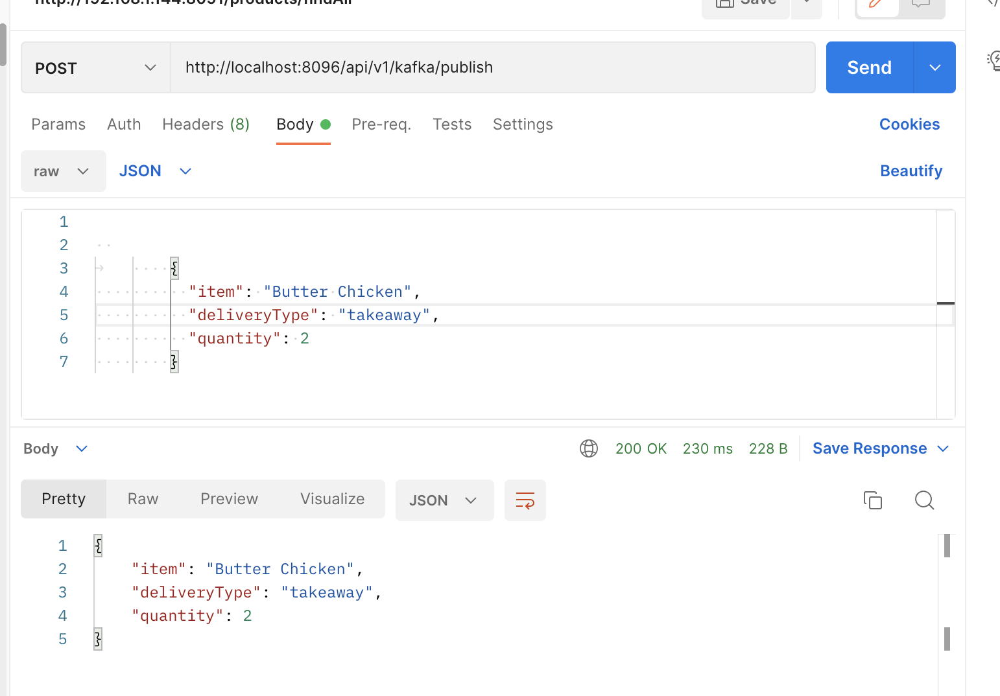
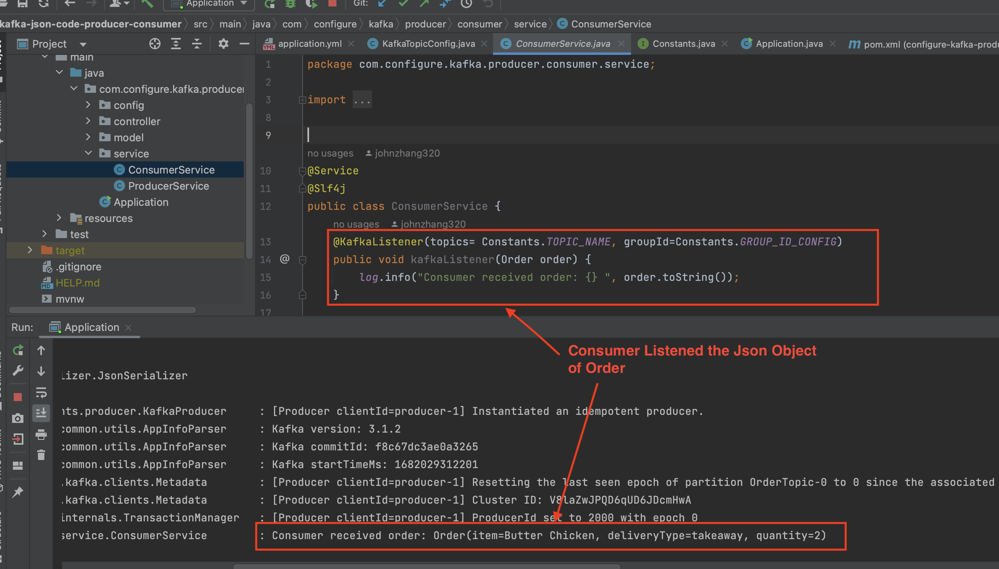
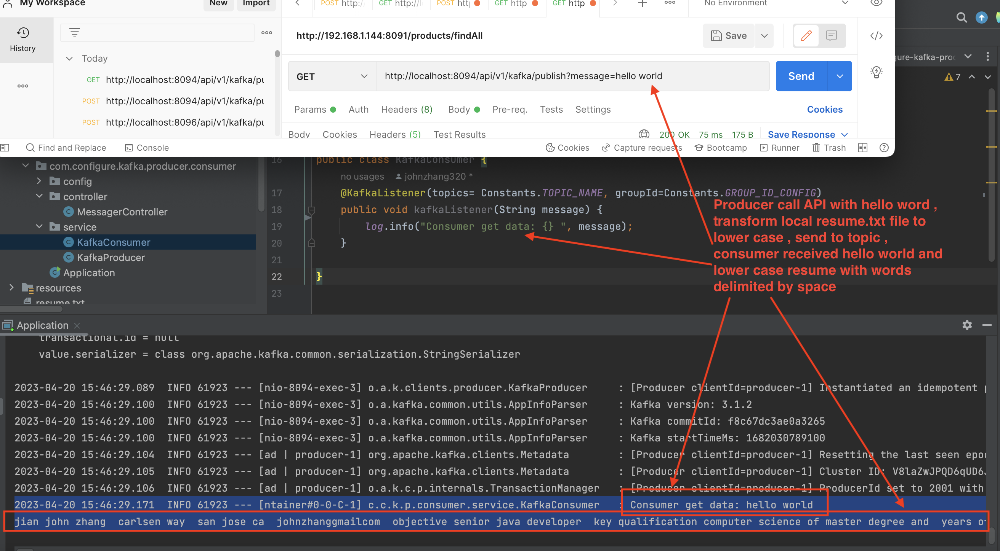

# spring-boot-kafka-event-driven
## spring boot kafka json and string producer and consumer 
  We created two sub projects:
  
  kafka-json-code-producer-consumer: serializes Java POJO to topic with Json string bytes and deserializes to Json String / listen the POJO
                                    
  
  kafka-message-code-producer-consumer: trasform local file (resume.txt) to lowercase and space delimited words, produce / consumer string message
  
  Instead of application.properties or application.yml configuration, we use configre code to fillful Kafka configuration
  Especially for  Which providing an approach to explicitly load JsonDeSerializer configuration by ConcurrentKafkaListenerContainerFactory  
  
   
## Start Zookeeper and Kafka
       download kafka_2.12-2.1.0.tgz from https://archive.apache.org/dist/kafka/2.1.0/kafka_2.12-2.1.0.tgz
       tar cvx kafka_2.12-2.1.0.tgz
       add $KAFKA_HOME point to your kafka installation directory 
       cd ./spring-boot-kafka-event-driven/kafka_start_stop
       chmod 755 *
       zookeeper_start.sh
       kafka_start.sh
       jps
       make sure following two processes running
       xxxx QuorumPeerMain
       xxxx Kafka
       
### all topics will be automatically created by java code   
   we can use shell script in directory kafka_start_stop to show topic, producer and consumer status content
   
## Produce and consume Json Object

  In configure-kafka-producer-consumer prject, we try transfer Order class from producer to consumer in Json format
  
      @Data
      @NoArgsConstructor
      @AllArgsConstructor
      @Builder
      @ToString
      public class Order {
          private String item;
          private String deliveryType;
          private Integer quantity;
      }
 
 
  As we know , KafkaTemplate works for Producer, so create KafkaTemplate bean by configure ProducerFactory for Kafka Bootstrap Server, 
  key StringSerializer and Value JsonSerializer 
  
        @Bean
        KafkaTemplate<String, Order> producerKafkaTemplate() {
            return new KafkaTemplate<>(producerFactory());
        }
        @Bean
        public ProducerFactory <String, Order> producerFactory() {
            Map<String, Object> config = new HashMap<>();
            config.put(ProducerConfig.BOOTSTRAP_SERVERS_CONFIG, Constants.BOOTSTRAP_NAME);
            config.put(ProducerConfig.KEY_SERIALIZER_CLASS_CONFIG, StringSerializer.class);
            config.put(ProducerConfig.VALUE_SERIALIZER_CLASS_CONFIG, JsonSerializer.class);
            return new DefaultKafkaProducerFactory<>(config);
        }
  For the consumer JSON configuration factory, besides Kafka Bootstrap Server, key StringDeserializer and value JsonDeserilizer, we especially
  need configure trust the producer model package or model Object, here is Order class, then use ConcurrentKafkaListenerContainerFactory to load
  the consumerfactory 
  
        @Bean
        public ConsumerFactory<String, Order> consumerFactory() {
            Map<String, Object> config = new HashMap<>();
            config.put(ConsumerConfig.BOOTSTRAP_SERVERS_CONFIG, Constants.BOOTSTRAP_NAME);
            config.put(ConsumerConfig.KEY_DESERIALIZER_CLASS_CONFIG, StringDeserializer.class);
            config.put(ConsumerConfig.VALUE_DESERIALIZER_CLASS_CONFIG, JsonDeserializer.class);
            // consumer must trust either Package or Model Object of producer, either one is OK !!!
            config.put(JsonDeserializer.TRUSTED_PACKAGES,"com.configure.kafka.producer.consumer.model.Order");
            return new DefaultKafkaConsumerFactory<>(config,new StringDeserializer(),new JsonDeserializer<>(Order.class));
        }
           /*
             KafkaTemplate only works for JSON producer configuration
             not for JSON consumer , consumer needs ConcurrentKafkaListenerContainerFactory
           */
        @Bean
        public ConcurrentKafkaListenerContainerFactory<String,Order> kafkaListenerContainerFactory () {
            ConcurrentKafkaListenerContainerFactory<String, Order> factory =
                    new ConcurrentKafkaListenerContainerFactory<>();
            factory.setConsumerFactory(consumerFactory());
            return factory;
        }
      
  Create ProducerService , which uses KafkaTemplate and ProductRecord to send the topic and order object 
  
        @RequiredArgsConstructor
        @Service
        @Slf4j
        public class ProducerService {
            private final KafkaTemplate<String, Order> kafkaTemplate;
            public void sendOrder(Order order) {
                log.info("sending order:"+order.toString());
                kafkaTemplate.send(new ProducerRecord<>(TOPIC_NAME, order));
            }
        }
 ConsumerService directly listens the Order Object by @KafkaListener
 

        @Service
        @Slf4j
        public class ConsumerService {
            @KafkaListener(topics= Constants.TOPIC_NAME, groupId=Constants.GROUP_ID_CONFIG)
            public void kafkaListener(Order order) {
                log.info("Consumer received order: {} ", order.toString());
            }
        }
        
 ## Result Test 
   Send data from postman to producer service
   
   
 
   Consumer listent the object of Order in Json format
   
   
   
   
 ## Producer and consumer for String Message
   In kafka-message-code-producer-consumer, configuration is simple, consumerfactory does not need to load into ConcurrentKafkaListener
   because consumer default accept string via stringDeserializer, all the code in repository, we do not need to example here
   Here only list the producer service code which will be called by controller and read the local resume.txt file to be java stream<String> and 
   convert string to lowercase and each words are delimited by a space then send to topic 
   
         ....
        @Service
        @Slf4j
        @RequiredArgsConstructor
        public class KafkaProducer {
            @Bean
            public NewTopic  createNewTopic () {
                return TopicBuilder.name(Constants.TOPIC_NAME).build();
            }

            private final KafkaTemplate<String, String > kafkaTemplate;

            public void sendMessage(String message) throws IOException {
                final Predicate<String> valueNotNullOrEmpty
                        = e -> e != null && !e.isEmpty() && e.trim().length()>1;

               Path path = Paths.get("src/main/resume.txt");
               List<String> words= Files.lines(path)
                       .flatMap(line -> Arrays.stream(line.trim().split("\\s")))
                       .filter(valueNotNullOrEmpty)
                       .map(word->word.replaceAll("[^a-zA-Z]","").toLowerCase().trim())
                        .collect(Collectors.toList());

                StringBuffer totalMsg= new StringBuffer();
                totalMsg.append(message+"\n");
                words.forEach(x->totalMsg.append(x+" "));
                log.info("Sending message {} ",totalMsg);
                kafkaTemplate.send("MySpringTopic", totalMsg.toString());
            }
        }
   
   
